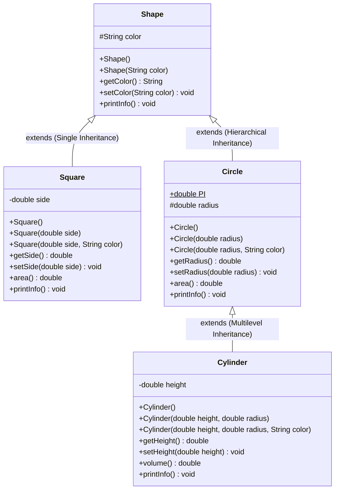

---

## 📖 Project Overview (نظرة عامة على المشروع)

This repository contains the complete implementation and exploration of **Encapsulation**, **Inheritance**, and **Polymorphism** in Java, based directly on the lecture material (slides 63–66, English version on page 66, and polymorphic concepts on pages 86–91).


---

## 🏛️ UML Architecture & Class Diagram



---

## 🔍 OOP Pillars: Where & How They Are Implemented

### 1. Encapsulation (التغليف / الكبسلة)
Encapsulation bundles data with the methods that operate on it and hides internal representation from arbitrary modification outside the class.

* **Where is it in the code?**
  * In [`Square.java`](file:///c:/Users/mh/Desktop/pbo/shapes/Square.java), the attribute `side` is declared `private`.
  * In [`Cylinder.java`](file:///c:/Users/mh/Desktop/pbo/shapes/Cylinder.java), the attribute `height` is declared `private`.
  * In [`Circle.java`](file:///c:/Users/mh/Desktop/pbo/shapes/Circle.java) and [`Shape.java`](file:///c:/Users/mh/Desktop/pbo/shapes/Shape.java), attributes use `protected` access so that derived subclasses can access them safely while blocking random external access.
  * Public Getters and Setters (`getSide()`, `setSide()`, `getRadius()`, `setRadius()`, `getHeight()`, `setHeight()`, `getColor()`, `setColor()`) provide controlled access.

* **Class Invariant Protection (حماية صحة البيانات ومنع القيم الخاطئة):**
  As explained on slide 22 and 23 of the lecture material, setters validate values to guarantee that attributes remain strictly positive:
  ```java
  public void setSide(double side) {
      if (side > 0) {
          this.side = side;
      } else {
          System.out.println("Warning: Invalid side length (" + side + "). Side must be positive!");
          this.side = 1.0;
      }
  }
  ```
  *(بالعربية: التغليف يضمن عدم قدرة أي كود خارجي على إدخال أطوال أو أبعاد سالبة، مما يحمي صحة الكائنات ويمنع النتائج الرياضية الخاطئة).*

---

### 2. Inheritance (الوراثة وإعادة استخدام الكود)
Inheritance allows a subclass to inherit attributes and methods from a superclass, modeling an `IS-A` relationship and maximizing code reuse.

* **Where is it in the code?**
  * **Single Inheritance (`Square extends Shape`)**:
    `Square` inherits `color` and `getColor()` without having to declare them again.
  * **Hierarchical Inheritance (`Circle extends Shape` & `Square extends Shape`)**:
    Both `Square` and `Circle` share common properties defined in `Shape`.
  * **Multilevel Inheritance (`Cylinder extends Circle extends Shape`)**:
    `Cylinder` inherits:
    - `color` and `getColor()` from `Shape`.
    - `radius`, `getRadius()`, and `area()` from `Circle`.
    - And adds its own specific attribute `height` and method `volume()`.

* **Constructor Chaining using `super(...)` (سلسلة المنشئات):**
  Subclasses cannot inherit constructors, so they must invoke the superclass constructor on the **very first line** (Slides 43, 56–61):
  ```java
  // Inside Cylinder.java:
  public Cylinder(double height, double radius, String color) {
      super(radius, color); // Invokes Circle's constructor, which invokes Shape's constructor
      setHeight(height);
  }
  ```

* **Code Reuse (إعادة استخدام الكود الموروث):**
  Instead of rewriting the circle area formula in `Cylinder`, `volume()` simply reuses the inherited `area()` method:
  ```java
  public double volume() {
      return area() * height; // Reuses Circle.area()!
  }
  ```

---

### 3. Polymorphism (تعدد الأشكال)
Polymorphism allows one interface/method call to behave differently based on the actual object instance.

#### A. Run-Time Polymorphism / Dynamic Binding (Overriding)
* **Where is it in the code?**
  * The method `printInfo()` is defined in `Shape`:
    ```java
    public void printInfo() {
        System.out.println("Shape colored " + color);
    }
    ```
  * It is overridden with `@Override` in each subclass to provide tailored output matching slide 66:
    * `Square`: `"Square colored [color], area = [area]"`
    * `Circle`: `"Circle [color], area = [area]"`
    * `Cylinder`: `"Cylinder [color], volume = [volume]"`
  * **The Polymorphic Array (`Shape[]`) in [`Main.java`](file:///c:/Users/mh/Desktop/pbo/shapes/Main.java)**:
    Just as shown in slides 89–91 ("Polymorphism in Action: An Array of Shapes"):
    ```java
    Shape[] shapeCollection = new Shape[4];
    shapeCollection[0] = new Shape("purple");
    shapeCollection[1] = new Square(4.0, "orange");
    shapeCollection[2] = new Circle(2.5, "cyan");
    shapeCollection[3] = new Cylinder(8.0, 2.5, "magenta");

    for (Shape s : shapeCollection) {
        s.printInfo(); // Executes the overridden method of the actual subclass at runtime!
    }
    ```
    *(بالعربية: حلقة دوران واحدة تتعامل مع مصفوفة من النوع العام `Shape`، وفي وقت التشغيل يحدد الـ JVM أي دالة `printInfo()` يتم استدعاؤها بحسب نوع الكائن الفعلي المخزن، دون الحاجة لجمل `if-else`).*

#### B. Compile-Time Polymorphism (Method & Constructor Overloading)
* Implemented via multiple overloaded constructors in `Shape`, `Square`, `Circle`, and `Cylinder`, allowing objects to be instantiated with different combinations of parameters.

---

## 💻 How to Compile and Run

Open your terminal or command prompt inside the `shapes` directory:

```bash
# 1. Compile all Java source files:
javac -encoding UTF-8 *.java

# 2. Run the main application:
java Main
```

*(You can also run `java ShapeDemo` as an alternative runner).*

---

## 📊 Program Execution Output (مخرجات البرنامج الفعلية)

Below is the verified console output generated when running option `1` (Automated Exploration) followed by option `6` (Exit):

```text
========================================================================
  5A - Self Exercise / Exploration of Inheritance and Polymorphism
  Object-Oriented Programming (PBO) - Informatics Engineering UNRAM
========================================================================

----------------------------- MAIN MENU -----------------------------
1. Run Automated Exploration (Tests Inheritance, Encapsulation, Polymorphism)
2. Explore Square Object (Create & Test Methods)
3. Explore Circle Object (Create & Test Methods)
4. Explore Cylinder Object (Create & Test Methods)
5. Explore Polymorphic Array (Shape[] with Dynamic Binding)
6. Exit
Please enter your choice (1-6): 1

=======================================================
       AUTOMATED EXPLORATION OF OOP CONCEPTS
=======================================================

[1] EXPLORING OBJECT CREATION & DIRECT CALLS (Pages 63-66):
-> Square printInfo():   Square colored red, area = 25.0
   Side: 5.0, Area: 25.0
-> Circle printInfo():   Circle yellow, area = 153.93804002589985
   Radius: 7.0, Area: 153.93804002589985
-> Cylinder printInfo(): Cylinder green, volume = 282.7433388230814
   Radius: 3.0, Height: 10.0, Volume: 282.7433388230814

[2] EXPLORING ENCAPSULATION & DATA VALIDATION:
-> Attempting to set negative side on Square (-4.5):
Warning: Invalid side length (-4.5). Side must be positive! Setting default 1.0
   Current side after protection: 1.0
-> Attempting to set invalid radius on Circle (-2.0):
Warning: Invalid radius (-2.0). Radius must be positive! Setting default 1.0
   Current radius after protection: 1.0

[3] EXPLORING INHERITANCE (is-a Relationship):
-> 'Square extends Shape' (Single Inheritance):
   Square color inherited from Shape: red
-> 'Cylinder extends Circle extends Shape' (Multilevel Inheritance):
   Cylinder inherits color from Shape:   green
   Cylinder inherits radius from Circle: 3.0
   Cylinder reuses base area() method:   28.274333882308138
   Cylinder computes its volume:         282.7433388230814

[4] EXPLORING RUNTIME POLYMORPHISM (Shape[] Array - Slides 89-91):
Iterating over Shape[] array with dynamic method dispatch:
Element [0] (Shape): Shape colored purple
Element [1] (Square): Square colored orange, area = 16.0
Element [2] (Circle): Circle cyan, area = 19.634954084936208
Element [3] (Cylinder): Cylinder magenta, volume = 157.07963267948966

=======================================================
           END OF AUTOMATED EXPLORATION
=======================================================

----------------------------- MAIN MENU -----------------------------
1. Run Automated Exploration (Tests Inheritance, Encapsulation, Polymorphism)
2. Explore Square Object (Create & Test Methods)
3. Explore Circle Object (Create & Test Methods)
4. Explore Cylinder Object (Create & Test Methods)
5. Explore Polymorphic Array (Shape[] with Dynamic Binding)
6. Exit
Please enter your choice (1-6): 6

Thank you for exploring Inheritance and Polymorphism! Goodbye.
```

---

## 📸 Screenshots (لقطات الشاشة)

> **Note for Student:** Take a screenshot of your terminal after running `java Main`, save the image file in this directory (e.g., as `screenshot.png`), and commit it to your GitHub repository.


---

## 📂 Repository File Structure

```text
shapes/
├── Shape.java       # Superclass with color and printInfo()
├── Square.java      # Subclass of Shape (Single Inheritance)
├── Circle.java      # Subclass of Shape (Hierarchical Inheritance)
├── Cylinder.java    # Subclass of Circle (Multilevel Inheritance)
├── Main.java        # Main exploration application with Scanner menu
├── ShapeDemo.java   # Convenience alias runner
└── README.md        # Comprehensive documentation & LMS submission guide
```
